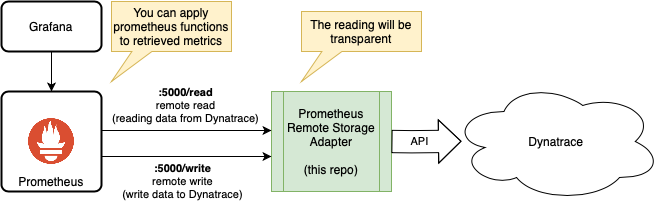

# Prometheus remote storage adapter for Dynatrace

This is an experiment to use Dynatrace as remote storage for Prometheus. It implements both, the `remote_read` as well as the `remote_write` functionality for Prometheus.

Possible Usecases:
- Query and combine data transparently through Prometheus
- Forward Prometheus-collected data to Dynatrace
- Design Grafana dashboards with Dynatrace data using PromQL
- Use the `remote_write` and `remote_read` implementation in Python as inspiration for other projects

## Architecture Overview

## Getting Started

### Using Docker
A minimal example can be launched using docker compose:

- Create a file named `.env` with your credentials:
```
DT_TENANT='tov08230.sprint.dynatracelabs.com'
DT_API_TOKEN='dt0c01.NS2DS75F...'
```
- Adjust the `docker-compose.yml` file to your needs (optional)
- run docker from the project root folder:
```
docker-compose up
```

Prometheus UI will be available on `http://localhost:9090`. There you can query for Dynatrace metrics using an adapted syntax where the `__name__` label represents the metric you're looking for (see limitations).
```
{__name__="builtin:synthetic.http.duration.geo"}
```

### Manual
You can run it on your own:

```
### If you use venv
# python3 -m pip install --user virtualenv
# python3 -m venv env
# source env/bin/activate

python3 -m pip install -r requirements.txt
```

You'll need to configure your tenant url and API token (API v2 with the metrics read/write capabilities). This can be done as ENV variables or inside an [.env file](https://pypi.org/project/python-dotenv/).

```
export DT_TENANT=<your_tenant_url>
export DT_API_TOKEN=<your_apiv2_token>
```

Then you're good to go:
```
python3 -m flask run
```

## Prometheus Configuration
Point your Prometheus instance to this application. See [documentation](https://prometheus.io/docs/prometheus/latest/configuration/configuration/#remote_write) for further configuration options.

Eg. if your Prometheus is running in a docker container use:
```
remote_read:
 - url: http://host.docker.internal:5000/read

remote_write:
- url: http://host.docker.internal:5000/write
  queue_config:
    max_samples_per_send: 1000
  metadata_config:
    send: true
```

## Limitations
There are some limitation:

### Dyntrace vs Prometheus metric naming
Metric and label/dimension naming rules between Dynatrace and Prometheus are varying slightly. Therefore following conversion will be applied:

`.`, `,` and `-` will be replaced by `_` on remote read (from Dynatrace)

`:` will be replace by `_` on remote write (to Dynatrace)


If you try to query Prometheus for an invalid metric name like `builtin:synthetic.http.duration.geo` (as `.` is not an allowed character) you'll see a message like:
```
Error executing query: invalid parameter "query": 1:18: parse error: unexpected character: '.'
```
As a workaround use the alternative syntax:

```
{__name__="builtin:synthetic.http.duration.geo"}
```

### Prometheus does not list remote metric names
As of now you can not get autocomplete of Dynatrace metrics in the UI. This is a known limitation for remote storage and is being addressed in [prometheus/prometheus#7076](https://github.com/prometheus/prometheus/pull/7076).
